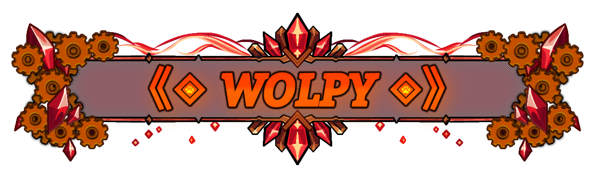
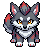
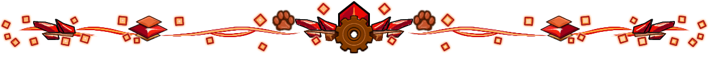
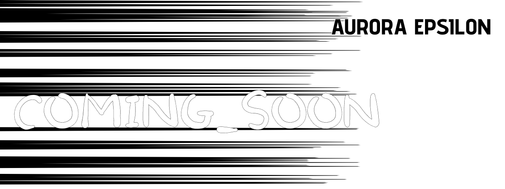
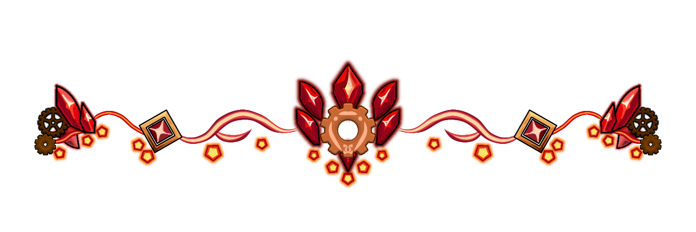
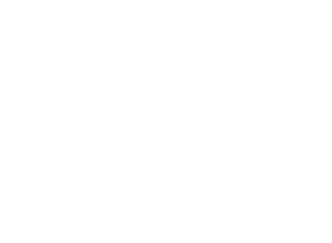

  <!-- Header / Hero Banner -->
  

  <!-- Container Teks (Sudah Digeser Turun ke 53%) -->
  

    <h2 align="center" style="
      background: linear-gradient(180deg, #ff9900 0%, #ff3300 60%, #990000 100%);
      -webkit-background-clip: text;
      -webkit-text-fill-color: transparent;
      font-family: 'Trebuchet MS', 'Courier New', monospace; 
      letter-spacing: 5px; 
      font-size: 30px; 
      font-weight: bold;
      filter: drop-shadow(2px 2px 0px #1a0000) drop-shadow(0px 0px 10px rgba(255, 69, 0, 0.8));
      margin: 0;
    ">
      《◈ 𝓦𝓞𝓛𝓟𝓨 ◈》
    </h2>
  

  <em>
    A furry creator turning imagination into reality. 
    Building little worlds, dreaming up characters, and experimenting with 3D art.
  </em>

  ✧ Furry Creator &nbsp;•&nbsp; ◈ Voxel Artist &nbsp;•&nbsp; ✦ Worldbuilder

---

# ♦➤ About Me

<!--- Avatar / Mascot !-->

  

<!-- Bilingual Bio Card (Tabel 2 Kolom Transparan) -->
<table align="center" style="border-collapse: collapse; border: none; background: transparent;">
  <tr style="border: none; background: transparent;">
    <td width="50%" align="center" style="border: none; padding: 10px; vertical-align: top;">
      <h3>🇮🇩 Indonesia</h3>
      

        Aku hanya suka membuat sesuatu dari ide yang muncul di kepala. 
        <strong>Voxel art, game, worldbuilding, karakter, cerita, sampai kode</strong> — semuanya menjadi karya untuk memberi bentuk nyata pada imajinasi.
      

    </td>
    <td width="50%" align="center" style="border: none; padding: 10px; vertical-align: top;">
      <h3>🇬🇧 English</h3>
      

        I just like making things from ideas that come to my mind. 
        <strong>Voxel art, games, worldbuilding, characters, stories, and even code</strong> — all of them become creations that give my imagination a real form.
      

    </td>
  </tr>
</table>

## 「 𝗪𝗵𝗮𝘁 𝗜'𝗺 𝗜𝗻𝘁𝗼 」

<table align="center" style="border-collapse: collapse; border: none; width: 100%;">
  <tr style="border: none;">
    <td width="50%" style="border: none; padding: 8px;">
      <blockquote style="margin: 0; border-left: 4px solid #ff5e00; background: rgba(255, 217, 0, 0.05);">
        <strong>🐾 Furry</strong> 
        A personal source of inspiration for characters, worlds, and creative ideas.
      </blockquote>
    </td>
    <td width="50%" style="border: none; padding: 8px;">
      <blockquote style="margin: 0; border-left: 4px solid #ff0000; background: rgba(255, 0, 0, 0.05);">
        <strong>🧊 Voxel Art</strong> 
        A comfortable way to bring characters, objects, and 3D worlds to life.
      </blockquote>
    </td>
  </tr>
  <tr style="border: none;">
    <td width="50%" style="border: none; padding: 8px;">
      <blockquote style="margin: 0; border-left: 4px solid #ff5e00; background: rgba(255, 217, 0, 0.05);">
        <strong>🌌 Worldbuilding & Lore</strong> 
        Creating worlds with characters, places, lore, factions, and stories.
      </blockquote>
    </td>
    <td width="50%" style="border: none; padding: 8px;">
      <blockquote style="margin: 0; border-left: 4px solid #ff0000; background: rgba(255, 0, 0, 0.05);">
        <strong>🎮 Bringing Ideas to Life 🎨</strong> 
        Turning imagination into reality through games, renders, and animations.
      </blockquote>
    </td>
  </tr>
</table>

<!-- Divider Epsilon / Aurora -->

  

---

# ♦➤ Featured Projects

✎﹏Beberapa proyek yang sedang atau pernah aku kerjakan, dari game dan dunia yang kubangun sampai berbagai eksperimen kecil.

## 「 Aurora Epsilon 」

<!--- Aurora Epsilon Artwork !-->

  

  <strong style="color: #ff6b35; font-size: 16px;">ᐯIᔕᑌᗩᒪ ᑎOᐯEᒪ + 3ᗪ ᖴᗩᑎTᗩᔕY GᗩᗰE</strong>

<blockquote style="border-left: 4px solid #ff4500; background: rgba(255, 69, 0, 0.05); padding: 10px 15px; margin: 15px 0;">
  A visual novel and 3D fantasy game I am currently developing. It features a handcrafted fantasy world filled with characters, a storyline, locations, and various things to discover.
</blockquote>

**Aurora Epsilon combines:**

- 🧊 **Voxel / Low-Poly Blocky Visuals**
- 🌌 **Fantasy Worldbuilding**
- 🐾 **Furry Characters**
- 🎮 **PC Gameplay 3D**
- 📖 **Visual Novel Elements**
- 🗺️ **Exploration & Story Progression**
- ✨ **A world designed to grow through future stories and updates**

 

**Tools:** `Godot` `GDScript` `Blockbench` `MagicaVoxel`

 

  

## 「 𝗦𝗸𝗶𝗹𝗹𝘀 」

### 🎮 Game Development

  
  
  

### 💻 Development

  
  
  
  
  

### 🎨 3D & Voxel

  
  
  

### 🛠️ Tools

  

### 🌐 Publishing

  

<!-- Footer Decoration / Divider -->

  

---

# ♦➤ Currently

<blockquote style="border-left: 4px solid #ff4500; background: rgba(255, 69, 0, 0.05); padding: 12px 18px; margin: 10px 0; font-family: monospace;">
  🌌 <strong>Building Aurora Epsilon</strong> 
  🧊 Exploring voxel & 3D art 
  🎮 Experimenting with game development 
  ✨ Turning new ideas into something real
</blockquote>

# 🐾 Find Me

  <i>My links, projects, and other places can be found here.</i>

  
  &nbsp;
  
  &nbsp;
  

<!-- Text Divider Kustom (Versi Clean & Glowing) -->

  ✦
   ───────── 
  ◈
   ───────── 
  ✦

<!-- Footer Copyright -->
<!-- Footer Decoration Icon -->

  

<!-- Text Divider Kustom -->

  ✦
   ───────── 
  ◈
   ───────── 
  ✦

<!-- Footer Copyright -->

  © 2026 <strong style="color: #e2e8f0;">Wolpy7e</strong> · All Rights Reserved

